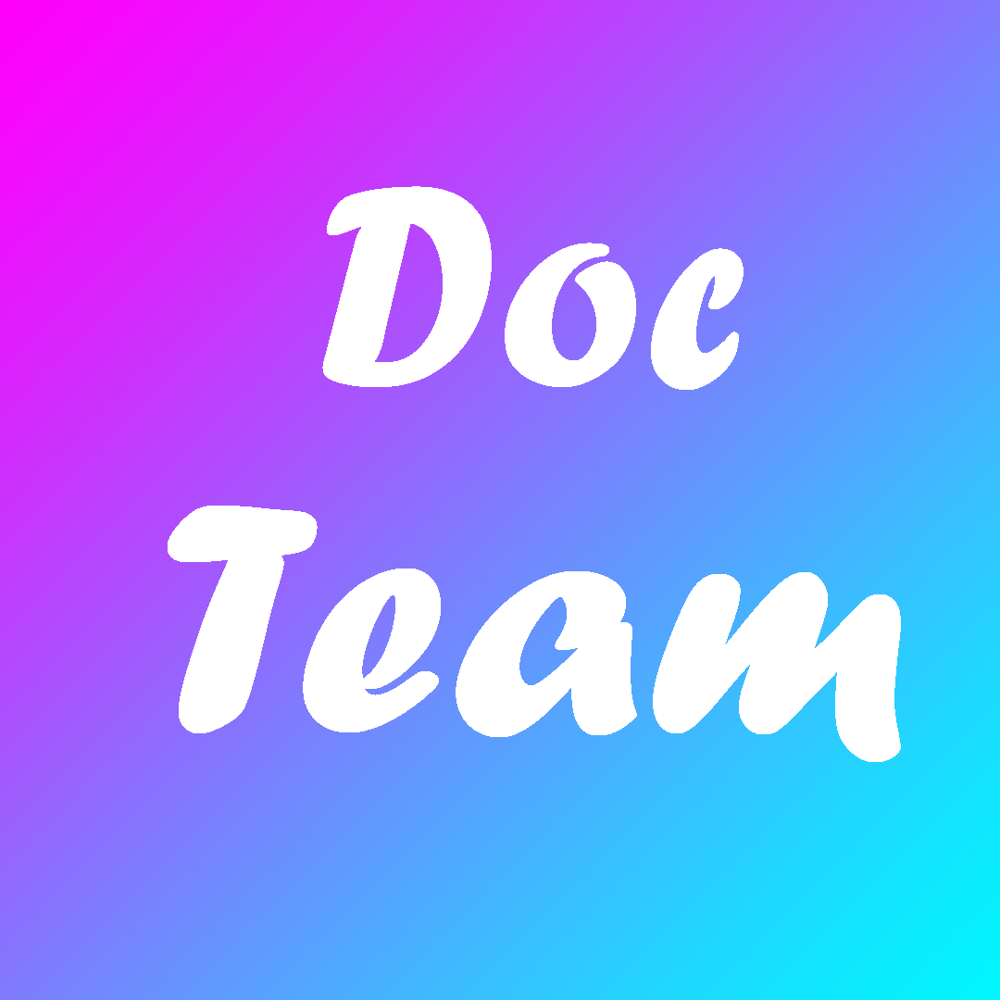

<h1>About Us (French/English)</h1>

        

---

<h1>Informations sur nous (French)</h1>

   📒 Nous sommes un groupe, qui codons, créons des mods ou autre, en rapport avec Minecraft.

   📲 Discord : Notre Discord est juste au dessus. Vous pourez y trouver des images des futurs nouvautés. Et Encore Plus.

   📝 Vous pouvez voir nos différents projet sur ce GitHub

   💻 Nous codons des DataPacks pour le Tardis Mod, Nous Condons des mods, et modifions des codes

   🔐 Certains de nos projet son privée, d'autre publique

   🔨 Notre DataPack du TardisMod n'est pas OpenSource/Sans source code publique.

---

<h1>About Us (English)</h1>

   📒 We are a team, who coding, create mods or whatever, related to Minecraft.

   📲 Discord: Our Discord is right above. You can find images of new futur release there. And even more.

   📝 You can see our different projects on this GitHub

   💻 We Coding Data Packs for the Tardis Mod, We create Mods, and Modify Codes

   🔐 Some of our projects are private, others are public

   🔨 Our TardisMod DataPack is not OpenSource / Without public code source.

---

English may contains error

---

Nous recrutons une équipe de rédactions (Sur Discord)

---

<h1>Remerciement à / Special Thanks to :</h1>

Conquerors (DataPack Tardis Builder)

Spoticraft (DataPack Tardis Builder)

---

<h1>Current project:</h1>
   - TardisMod Datapack (In dev)
   - CapMine Minecraft Server

---

<h1>This is a Beta Test project, Thanks for Bug/Suggestion on https://github.com/DocTeam/DocTeam/issues</h1>